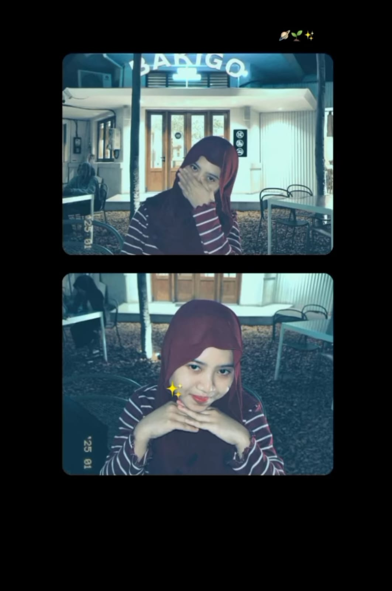

[Hbd putri.html](https://github.com/user-attachments/files/24084790/Hbd.putri.html)
<!DOCTYPE html>
<html lang="en">

<head>[Uploading main.css…]()

  <meta charset="UTF-8" />
  <meta name="viewport" content="width=device-width, initial-scale=1.0" />
  <meta http-equiv="X-UA-Compatible" content="ie=edge" />
  <link rel="shortcut icon" type="image/png" href="img/favicon.png" />
  <title>Happy Birthday!!! :)</title>
  <!-- Google Font -->
  <link rel="preconnect" href="https://fonts.googleapis.com">
  <link rel="preconnect" href="https://fonts.gstatic.com" crossorigin>
  <link href="https://fonts.googleapis.com/css2?family=Poppins:wght@300;400&display=swap" rel="stylesheet">
  <!-- My Style -->
  <link rel="stylesheet" href="./style/main.css" />
</head>

<body>

    <audio class="song" loop autoplay>
        <source src="./music/hbd.mpeg">
        </source>
        Your browser isn't invited for super fun audio time.
    </audio>

    

        

            <h1 class="one">
                Hi
                Putri
            </h1>
            
Maybe is not big gift

        

        

            
It's your birthday!! :D

        

        

            

                

                Happy birthday to youu!! Ciee udahh naik aja nihh wkwkwwk akhirnya ultah juga kamu ya nak yaa gabanyak si yg pe tak sampaikan, aku slalu berharap apapun kesulitan sing mok adepi bisa terlewatkan lancar kerjaanmu juga , intie im proud of u bocil krembangann nggondokann (semoga ngga nggondokan neh).
                

                
Send

            

        

        

            
Apapun sing inginkan tercapai.

            
Kuliahmu haruss lebih semangatt.

            

                Gaolee insecuree, awamu iku ayu pinter lucu 
                <strong>LENGKAPPP</strong>
                .
            

            
Jadi,

            

                You are Special
                :)
            

            

                S
                O
            

        

        

            
            
            

                <h3 class="wish-hbd">Happy Birthday!</h3>
                <h5 id="wishText">Thanks for being my partner,im so grateful! ;)</h5>
            

        

        

            

                
                
                
                
                
                
                
                
                
                
                
                
                
                
                
                
                
                
                
                
                
                
                
                
                
                
                
                
                
                
                
                
                
            

        

        

            <svg viewBox="0 0 40 40" xmlns="http://www.w3.org/2000/svg">
                <circle cx="20" cy="20" r="20" />
            </svg>
            <svg viewBox="0 0 40 40" xmlns="http://www.w3.org/2000/svg">
                <circle cx="20" cy="20" r="20" />
            </svg>
            <svg viewBox="0 0 40 40" xmlns="http://www.w3.org/2000/svg">
                <circle cx="20" cy="20" r="20" />
            </svg>
            <svg viewBox="0 0 40 40" xmlns="http://www.w3.org/2000/svg">
                <circle cx="20" cy="20" r="20" />
            </svg>
            <svg viewBox="0 0 40 40" xmlns="http://www.w3.org/2000/svg">
                <circle cx="20" cy="20" r="20" />
            </svg>
            <svg viewBox="0 0 40 40" xmlns="http://www.w3.org/2000/svg">
                <circle cx="20" cy="20" r="20" />
            </svg>
            <svg viewBox="0 0 40 40" xmlns="http://www.w3.org/2000/svg">
                <circle cx="20" cy="20" r="20" />
            </svg>
            <svg viewBox="0 0 40 40" xmlns="http://www.w3.org/2000/svg">
                <circle cx="20" cy="20" r="20" />
            </svg>
            <svg viewBox="0 0 40 40" xmlns="http://www.w3.org/2000/svg">
                <circle cx="20" cy="20" r="20" />
            </svg>
        

        

            
Okay, now come back and tell me if you liked it.

            
Or click, if you want to watch it again.

            
:)

        

    

</body>
    <!-- Greensock -->
    
    <!-- Sweetalert -->
    
    

</html>
